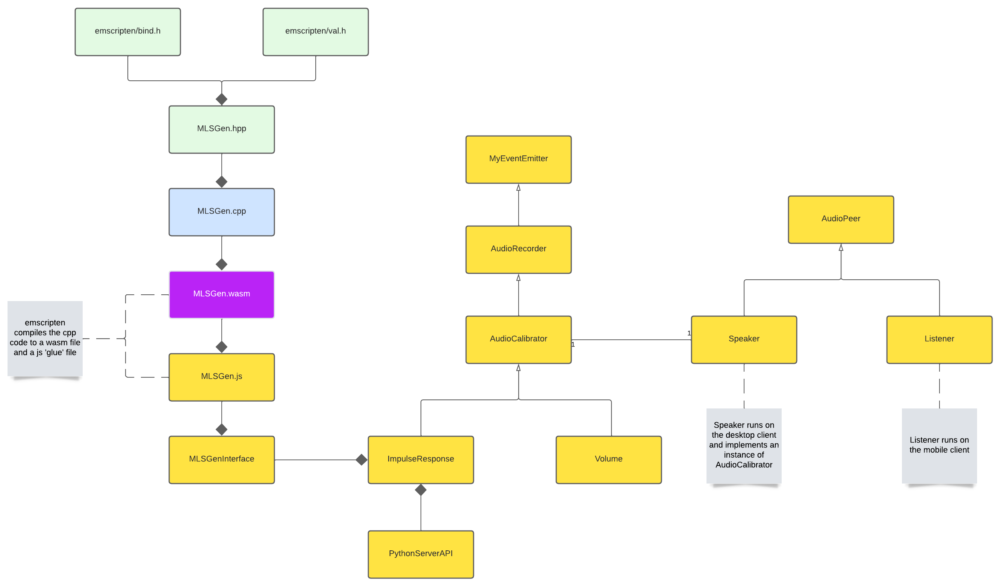
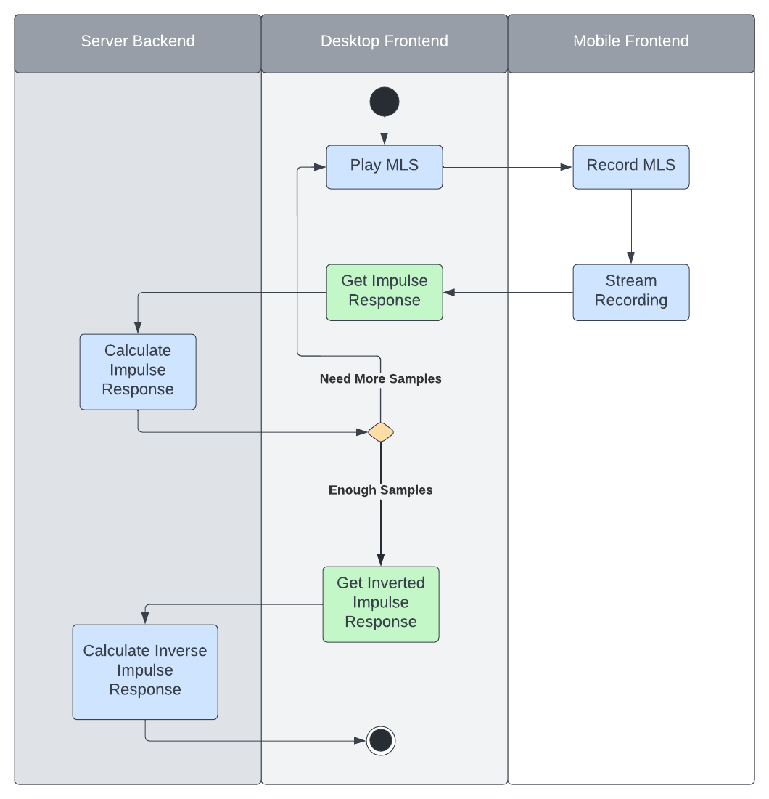

# Speaker-Calibration
Speaker-Calibration provides a simple API for performing speaker calibration in Javascript. The Library has minimal dependencies and is designed to be used in the browser. 

[](https://app.netlify.com/sites/focused-hodgkin-0a6531/deploys)

## Usage
```html
<!-- index.html --->
...
<body>
    ...
    <script src="https://unpkg.com/speaker-calibration@1.4.1/dist/main.js"></script>
</body>
```
```javascript
// speaker.js

// initialize the chosen calibrator with the paramters, or pass no paramters to use default settings
const calibrator = new ImpulseResponseCalibration({
    numCaptures: 3,
    numMLSPerCapture: 3,
    download: false,
});

// pass the calibrator and speaker paramters to the startCalibration method (async)
const invertedIR = await Speaker.startCalibration(
    {
        siteUrl: window.location.href.substring(0, location.href.lastIndexOf('/')),
        targetElementId: 'display',
    },
    calibrator
);
```
```javascript
// listener.js

window.listener = new speakerCalibrator.Listener({
    targetElementId: 'display',
});
```
## UML Design


## Impulse Response Calibration Logic


---

## Contribution Guidelines

_As of 07/29/2022_


### Initial Setup

1. `git clone https://github.com/EasyEyes/speaker-calibration.git`
2. `cd speaker-calibration`
3. `npm i`


All outputs from the scripts/recipies below should be automatically placed in the `/dist` directory.
This is what will be served once the library is published.

#### Example

In `/dist/example` you will find a small example app that uses the `speaker-calibration` library.

#### Javascript

In `package.json` you will see some key scripts:

1.  `build:prod` tells webpack to build the library in production mode,
    outputing to `/dist`
2.  `build:dev` tells webpack to build the library in development watch mode,
    outputing to `/dist`
3.  `build:dev:analyze` tells webpack to build the library in development mode and open up a bundle analysis page. Helpful for viewing the size of the library, broken down by individual modules and/or dependencies.
4.  `serve:dev` spins up an `express.js` server on port `3000` using `nodemon`. It serves the
    `/dist` & `/dist/example` folders.
5.  `build:wasm` calls the makefile recipe to clean, and rebuild the web assembly code (requires emscripten installed, more details below)
6.  `lint` runs `eslint` on all js files in the project
7.  `lint:fix` lints and automatically fixes all js files in the project.
8.  `build:doc` builds the documentation using `jsdoc`. Outputs to `/doc`

Run `(2)` & `(3)` in seperate shell windows, with this setup you will be able to modify both the
library and front end examples with hot reload built in. Run `(7)` precommit to keep you code standardized.

#### CPP/WASM

We are using [Emscripten](https://emscripten.org/) to compile the C++ code into a wasm file. Usage
requires the installation of the Emscriten compiler. Instructions can be found on their website. In
`makefile` you will see a few recipies:

- `mlsGen_bind` compiles the cpp files to wasm, generating a modularized javascript "glue" file,
  using embind. This is the current build target
- `mlsGen_module` compiles the cpp files to wasm, generating a modularized javascript "glue" file.
- `mlsGen_wasm` compiles the cpp file to a stand-alone wasm without a javascript "clue" file.
- `clean` cleans up and generated code
- `rebuild` cleans and rebuilds the output. Run this after making changes to the cpp files.

#### Documentation

We use [jsdoc](https://jsdoc.app/) standards to document our library.

#### Linting

We use [ESLint](https://eslint.org/) to lint our code and enforce best practices. We are currently
using [AirBnB's JavaScript Style Guide](https://airbnb.io/javascript/)

#### Styling

We use [Prettier](https://prettier.io/) to format our code.

---


### Deployment

* Changes publshed to `main` will automatically trigger a deploy on the `netlify` project. This deployment is only relevant to the `example` app, it will not make any changes to any others using the library. 
* `speaker-calibration` is library that is published to [npm](https://www.npmjs.com/). This means that in order to make your changes 'live' a new version of the library needs to be published. Conveniently, there exists an npm package [np](https://www.npmjs.com/package/np) which provides a lot of helpful abstractions and UI elements when dealing with npm. 
* Once a new version of the library is published, it is then live for anyone to use by bumping the version they're using up to the newest release. 


